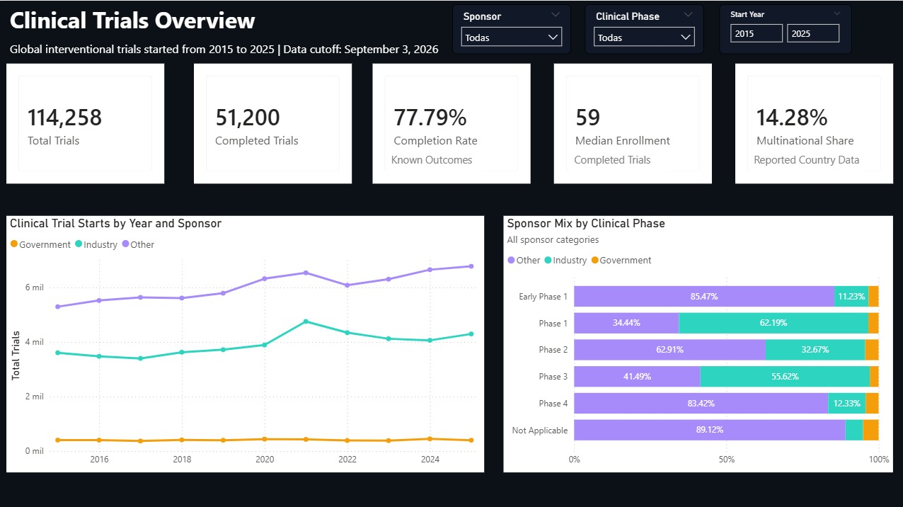
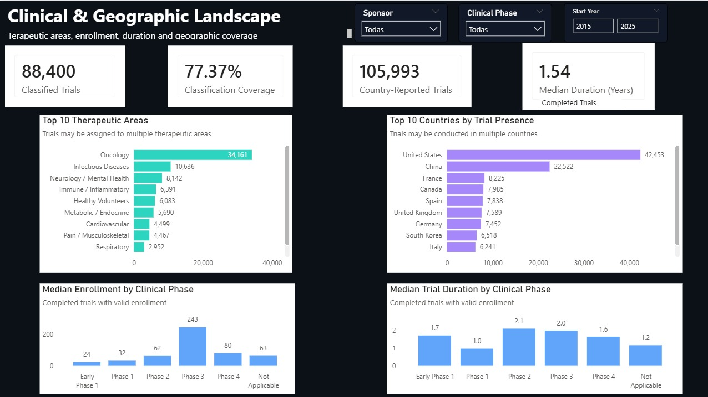

# Pharma & Clinical Trials Analytics

End-to-end data analytics project exploring pharmaceutical and biotechnology
clinical trials using data from ClinicalTrials.gov.

The project combines **Python, PostgreSQL, SQL and Power BI** to extract,
clean, model, analyze and visualize clinical research data.

---

## Project Overview

Clinical trial registries contain large amounts of publicly available data,
but extracting meaningful insights requires transforming complex study-level
information into a structured analytical model.

This project analyzes clinical research activity across:

- Clinical development phases
- Sponsor types
- Therapeutic areas
- Study outcomes
- Patient enrollment
- Trial duration
- Intervention types
- Geographic distribution

The final analytical dataset contains **114,258 unique clinical trials**.

---

## Business Question

**How does pharmaceutical clinical research vary across therapeutic areas,
clinical development phases, sponsors and geographic regions?**

The objective is to transform raw registry data into an analytical model that
can support exploration of clinical development patterns and research activity.

---

## Data Source

**ClinicalTrials.gov API v2**

The analysis includes:

- Interventional studies
- Drug and/or biological interventions
- Study start dates between **2015 and 2025**
- Data snapshot cutoff: **September 3, 2026**

A fixed local snapshot was used during development to preserve reproducibility.

---

## Analytical Workflow

```text
ClinicalTrials.gov API
        │
        ▼
      Python
Extraction · Cleaning · Validation · EDA
        │
        ▼
Analytical Data Model
        │
        ├── clinical_trials
        ├── trial_countries
        └── trial_therapeutic_areas
        │
        ▼
   PostgreSQL / SQL
Validation · Joins · Aggregations · CTEs
        │
        ▼
      Power BI
Interactive Dashboard
```

### Python

Python was used for:

- API extraction and pagination
- Data cleaning and transformation
- Missing-value and duplicate validation
- Clinical phase standardization
- Sponsor categorization
- Trial status grouping
- Duration calculations
- Enrollment quality control
- Therapeutic-area classification
- Geographic analysis
- Exploratory data analysis

### PostgreSQL / SQL

The processed tables were loaded into PostgreSQL to create a relational
analytical model.

SQL was used for:

- Primary and foreign key validation
- Referential-integrity checks
- Duplicate validation
- Aggregations
- Joins
- Common Table Expressions (CTEs)
- Window functions
- Independent validation of Python findings

### Power BI

Power BI was used to build an interactive dashboard focused on:

- Clinical trial portfolio overview
- Sponsor composition
- Clinical development phases
- Therapeutic areas
- Enrollment
- Trial duration
- Geographic distribution

---

## Data Model

The analytical model consists of three main tables:

| Table | Rows | Description |
|---|---:|---|
| `clinical_trials` | 114,258 | One record per clinical trial |
| `trial_countries` | 210,932 | Trial-to-country relationships |
| `trial_therapeutic_areas` | 121,169 | Trial-to-therapeutic-area relationships |

The bridge-table structure allows individual trials to be associated with
multiple countries and therapeutic areas while preserving one record per
clinical trial in the primary table.

---

## Key Findings

### Sponsor Portfolio

**Other sponsors represented 58.20%** of the clinical trial portfolio,
followed by:

- Industry: **37.88%**
- Government: **3.92%**

The broad Other category primarily includes academic institutions, hospitals
and research organizations.

### Clinical Development

Sponsor portfolios showed different phase distributions.

- Industry trials were strongly concentrated in **Phase 1**
- Government and Other sponsors had their largest share in **Phase 2**
- Phase 4 represented a substantially larger share among Other and Government
  sponsors than among Industry sponsors

### Trial Outcomes

Among trials with known final outcomes:

- Industry completion rate: **80.00%**
- Government completion rate: **79.43%**
- Other completion rate: **75.62%**

These comparisons are descriptive and may also reflect differences in phase,
therapeutic area, study design and reporting practices.

### Enrollment

Median reported enrollment increased across early development and reached its
highest value in **Phase 3**, with a median of **243 participants**.

Mean enrollment was substantially higher than the median in several phases,
indicating strongly right-skewed enrollment distributions.

### Trial Duration

Among completed trials:

- Phase 2 had the longest median observed duration: **2.10 years**
- Phase 3: **1.99 years**
- Early Phase 1: **1.72 years**
- Phase 4: **1.65 years**
- Phase 1: **0.97 years**

Trial duration therefore did not increase monotonically with clinical phase.

### Therapeutic Areas

**Oncology was the most frequently represented therapeutic area**, appearing
in **34,161 trials (29.90%)**.

Other highly represented areas included:

- Infectious Diseases
- Neurology / Mental Health
- Immune / Inflammatory
- Healthy Volunteers
- Metabolic / Endocrine

Individual trials may belong to more than one therapeutic area.

### Geographic Scope

Among trials with reported country information:

- **85.72%** were single-country studies
- **14.28%** were multinational studies

Industry-sponsored trials showed the highest multinational share at
**31.34%**, compared with:

- Government: **8.19%**
- Other: **3.15%**

---

## Technologies

- Python
- Pandas
- NumPy
- Requests
- Matplotlib
- Seaborn
- PostgreSQL
- SQLAlchemy
- SQL
- Power BI
- Jupyter Notebook

---

## Repository Structure

```text
Pharma-Clinical-Trials-Analytics/
│
├── pharma_clinical_trials_analysis.ipynb
├── README.md
├── requirements.txt
├── .gitignore
│
├── sql/
│   └── clinical_trials_analysis.sql
│
├── powerbi/
│   └── Pharma_Clinical_Trials_Dashboard.pbix
│
└── images/
    ├── dashboard_overview.png
    └── clinical_geographic_landscape.png---

## Reproducing the Analysis

Clone the repository and install the required Python dependencies:

```bash
pip install -r requirements.txt
```

The notebook retrieves clinical trial data from the ClinicalTrials.gov API
when a local raw snapshot is not available.

PostgreSQL is required to reproduce the SQL section of the analysis.

The PostgreSQL connection parameters in the notebook should be adjusted
to match the user's local PostgreSQL configuration before running the
SQL section.
---

## SQL Analysis

The main analytical SQL queries are also available separately in:

```text
sql/clinical_trials_analysis.sql
```

This allows the SQL component of the project to be reviewed independently
from the Jupyter Notebook.

---

### Dashboard

The Power BI dashboard provides two complementary analytical views.

### Clinical Trials Overview

High-level exploration of the clinical trial portfolio by sponsor, phase,
study year and outcome.



### Clinical & Geographic Landscape

Exploration of therapeutic areas, enrollment, trial duration and geographic
distribution.



The complete Power BI project file is available in the `powerbi/` directory.
---

## Author

**Jorge Cerón**

Data Analyst with a background in diagnostic biochemistry, biomedicine,
molecular biotechnology and human genetics/genomics.

[LinkedIn](https://www.linkedin.com/in/jorge-ceron-albarran333) ·
[GitHub](https://github.com/JorgeCeronDA)
